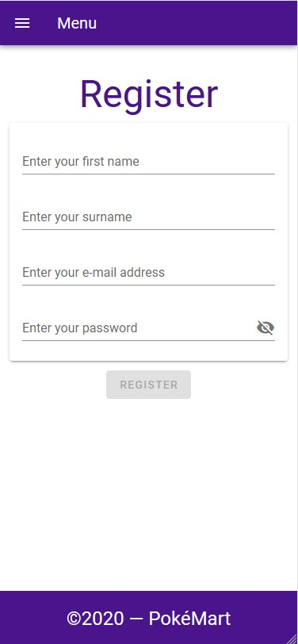
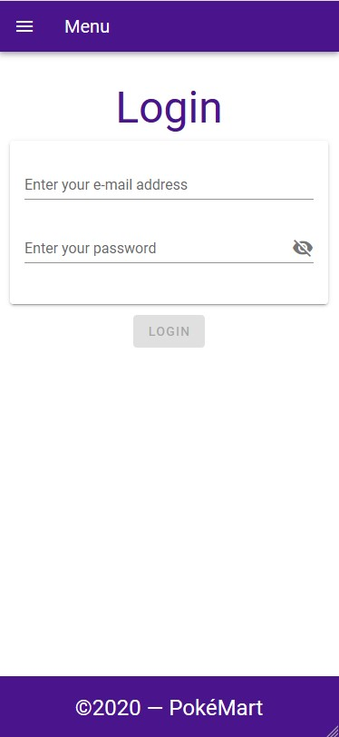
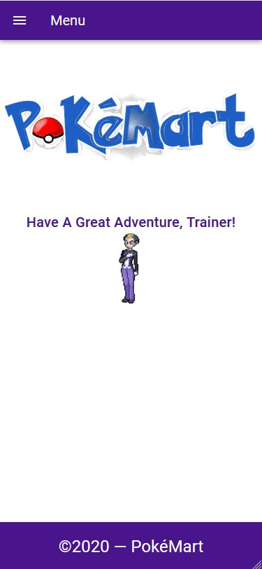
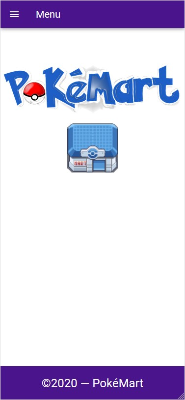
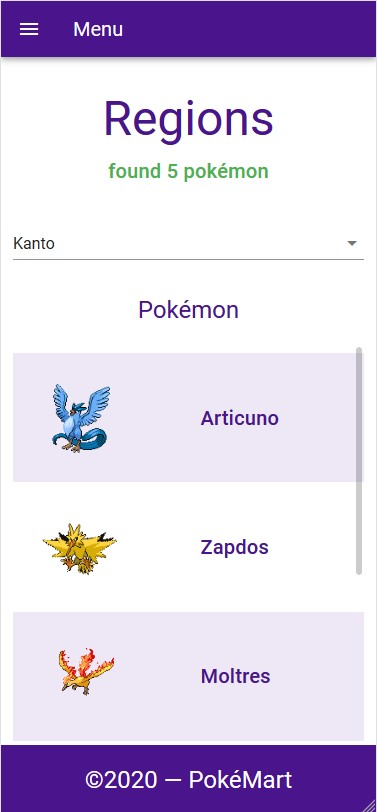
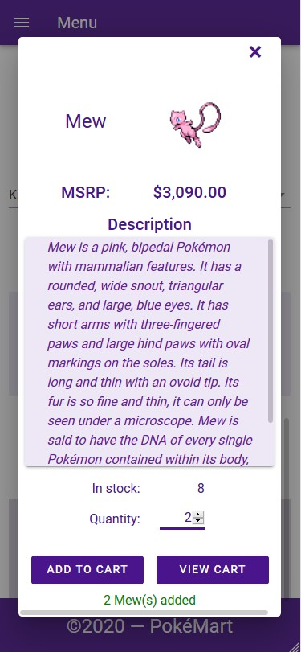
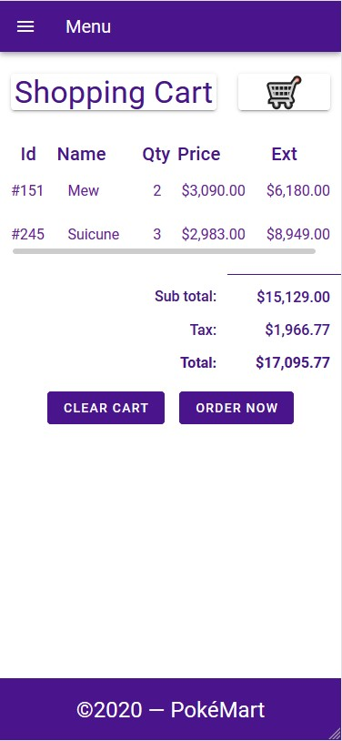
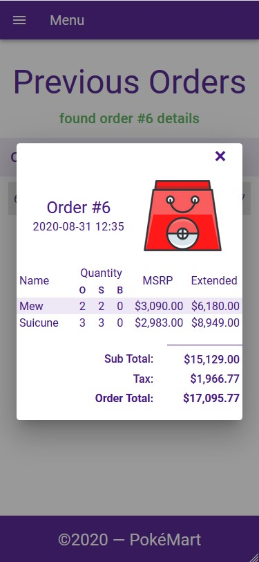
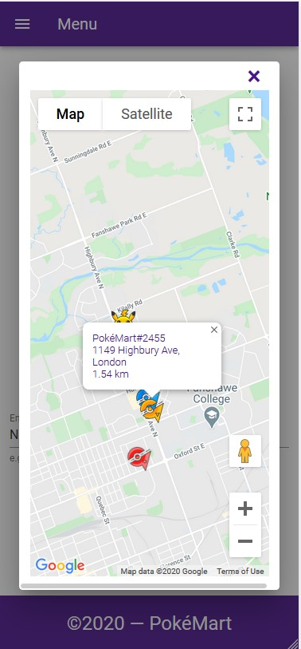

# PokéMart

A simple full-stack web application written for mobile platform that allows users to register, order Pokémon and search for nearest stores.   

Demo: **https://pokemart.azurewebsites.net** _(should be viewed in mobile footprint)_.    
The following account is already created for testing purpose: 
- Email: `guest@email.com`
- Password: `PikachuIsOverrated`

## Table of Contents
- [About the Project](#about-the-project)
- [Resource](#resource)
- [Features](#features)
- [Highlights](#highlights)
- [Acknowledgement](#acknowledgement)

## About the Project
### Front-end
Front-end of the project was built exclusively with:
- [Vue.JS](https://vuejs.org/) 2.6 Framework   

Depedencies that were used:
- [Vuetify](https://vuetifyjs.com/en/) Framework: to design UI.
- [vue-route](https://router.vuejs.org/) Library: to set up route - component mapping.
- [vue-currency-filter](github.com/mazipan/vue-currency-filter) Plugin: to format currency.

### Back-end
Back-end of the project was written in C# and built with:   
- [ASP.NET Core 3.1](https://dotnet.microsoft.com/download) Framework

Dependencies that were used:   
- [Entity Framework Core](https://github.com/dotnet/efcore): to set up and connect to database

### Database
Database was stored locally in [Microsoft SQL Server](https://en.wikipedia.org/wiki/Microsoft_SQL_Server) and in [Azure SQL databases](https://azure.microsoft.com/en-ca/services/sql-database/) service.

### Deployment
The application was deployed to [Microsoft Azure](https://azure.microsoft.com).

## Resource
The project used several images of legendary Pokémon as virtual product. The list of pokemon is as follows:   

-  Arceus
-  Articuno
-  Azelf
-  Celebi
-  Cobalion
-  Cresselia
-  Darkrai
-  Deoxys
-  Dialga
-  Entei
-  Genesect
-  Giratina
-  Groudon
-  Heatran
-  Ho-oh
-  Jirachi
-  Keldeo
-  Kyorge
-  Kyurem
-  Landorus
-  Latias
-  Latios
-  Lugia
-  Manaphy
-  Meloetta
-  Mesprit
-  Mew
-  Mewtwo
-  Moltres
-  Palkia
-  Phione
-  Raikou
-  Rayquaza
-  Regice
-  Regigigas
-  Regirock
-  Registeel
-  Reshiram
-  Shaymin
-  Suicune
-  Terrakion
-  Thundurus
-  Tornadus
-  Uxie
-  Victini
-  Virizion
-  Zapdos
-  Zekrom   

These images should be formatted as `.png` and stored in `src\FrontEnd\src\assets\img\products\animated\`.

Also, customized marker icons were used to pin store location on Google Map. These icon should be formatted as `.png` and stored in `src\FrontEnd\public\img`.

The location of PokéMart stores used in the application was based on the location of Tim Hortons stores in Canada.

> **Notes:** All these resource, images and database, are **NOT** included, but you know where to find it 😉.

## Features
- There are three pages that are available for unregistered visistors: **Register** page, **Login** page and **Log out** page.   

| | | |
| --- | --- | --- |
|  |  |  |

- Usually, customers are redirected to **Home** page after logging in. At this point, the other pages are also available.   

- **Regions** is the place to find Pokémon in order to place an order. These Pokémon are categorized into different regions, the same analogy to that products are from different brands. After selecting a Pokémon, a short description about that Pokémon and the number available in stock will be displayed to the customer. On this page, they can either add the selected Pokémon to their cart or view their shopping cart.

| | |
| --- | --- |
|  |  |

- **Shopping cart** page summaries the order. After placing the order, customers can view their order history in **Order History** page.

| | |
| --- | --- |
|  |  |

- **Map** page is where customers can find three nearest stores to their places.

 

## Highlights
### RESTful API
PokéMart is designed to follow the REST architecture.   
The two HTTP methods that are utilized to set up communication between front-end and back-end are `GET` and `POST`.    
- `HTTP GET` are used to **retrieve information** from the back-end. Specifically, request of Pokémon list, order history, etc.    
- `HTTP POST` are used to **send information** from front-end to back-end. Specifically, send the customer information in the register page or login page.

### Authentication and Authorization
Instead of storing customer's password as raw string, a hash function is used to generate a unique string for each password. Also, a salt is also included in the hash-generated process to prevent precomputation attack although PokéMart would never be attacked though 😎. The hash string is generated by using `Rfc2898DeriveBytes` class, which uses [SHA1](https://en.wikipedia.org/wiki/SHA-1) hash function.

[JSON Web Token (JWT)](https://en.wikipedia.org/wiki/JSON_Web_Token) is used to authorize customer. For each request from an authorized customer, a JWT specific for this customer is included in the header of the HTTP request to provide the signature of the customer.

### Nearest Stores
To response to a request of nearest stores, a stored procedure in the database server will be called to produce three nearest stores to the specified location.    
> **Notes**: The stored procedure implementation can be found at `src\Database\distance_procedure.sql`.   

After receiving the result from the database server, back-end will wrap up the location of these stores and send back to front-end.

## Acknowledgement
- The project is the final product of INFO3067 course
- Special thanks to **Professor Evan Lauersen** for his detailed instruction.

